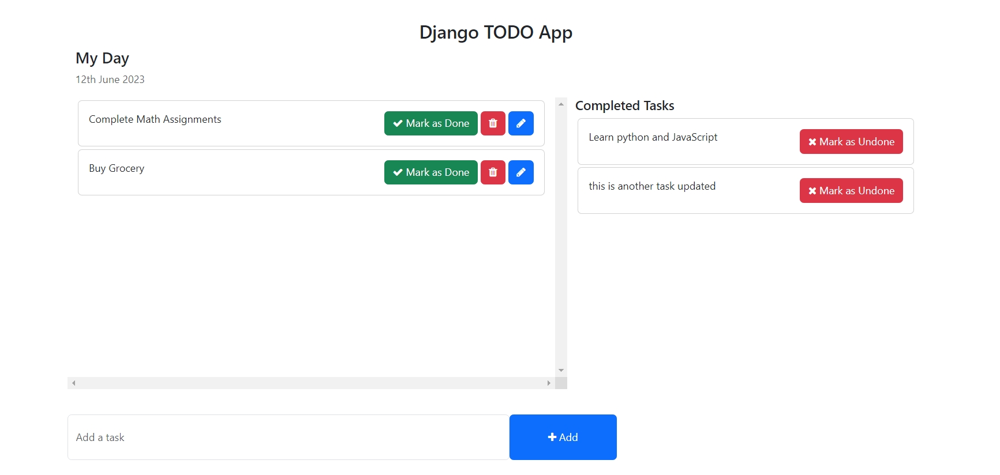

# CRUD Todo App

A CRUD Todo App! With this user-friendly application, managing your tasks has never been easier. Create, read, update, and delete todos effortlessly. Start by adding a new task with a title. The app provides a clean and intuitive interface to view and organize your todos. Update any task details at any time to keep them accurate and relevant. Need to remove a completed or outdated task? Simply delete it with a single tap. Stay organized and productive with this efficient app. Whether you're a student, professional, or homemaker, the Simple CRUD Todo App is a must-have tool. Experience a seamless task management system right at your fingertips!

## Views

  

## Setup

- Clone the project: `git@github.com:rOluochKe/django-todo-app.git`
- Change directory into : `cd /django-todo-app`
- Create your environment and install dependencies: `pip install -r requirements.txt`
- Create admin user `python manage.py createsuperuser`
- Run app: `python manage.py runserver`
